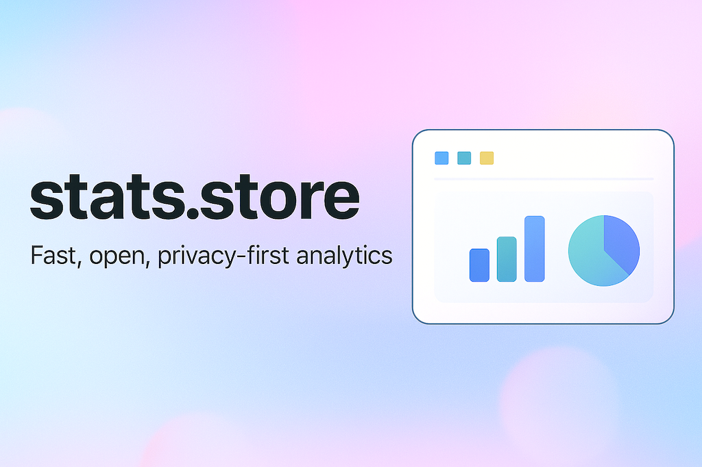

# stats.store

**Simple, privacy-first analytics for Sparkle-enabled Mac apps. Free for open source projects.**

## What is stats.store?

If you have a Mac app that uses [Sparkle](https://sparkle-project.org/) for updates, stats.store gives you basic analytics without being creepy about it. Think of it as a friendly way to answer simple questions:

- How many people use my app?
- What macOS versions should I support?
- Are people actually updating when I release new versions?

**What we collect:**

- macOS version and CPU type (Intel vs Apple Silicon)
- App version numbers
- Daily unique users (anonymized)
- Basic hardware info (RAM, Mac model)

**What we DON'T collect:**

- No IP addresses or personal data
- No usage tracking or behavior analytics
- No creepy fingerprinting
- No third-party trackers

## Free for Open Source

Building an open source Mac app? It's completely free! Just [email Peter](mailto:peter@steipete.me) and he'll add your app.

## How It Works (The Magic Part! ✨)

Here's the clever bit: instead of modifying your app's code, stats.store acts as a friendly middleman for your Sparkle updates. When your app checks for updates, it goes through stats.store, which:

1. Notes that someone is using your app (anonymously!)
2. Fetches your real update file from GitHub/wherever
3. Passes it along to your app

Your users get their updates, you get your stats. Everyone wins!

### Setting It Up (It's Just One URL Change!)

In your app's `Info.plist`, change your update URL from:
\`\`\`xml
<key>SUFeedURL</key>
<string>https://raw.githubusercontent.com/you/yourapp/main/appcast.xml</string>
\`\`\`

To:
\`\`\`xml
<key>SUFeedURL</key>
<string>https://stats.store/api/v1/appcast/appcast.xml</string>
\`\`\`

That's it! stats.store will automatically find your real appcast file and serve it while collecting anonymous stats.

## The Dashboard

Check out your stats at [stats.store](https://stats.store). You'll see:

- Daily active users
- macOS version breakdown (pretty charts!)
- CPU architecture distribution
- Version adoption rates

## Self-Hosting

Want to run your own instance? Cool! Check out the [deployment guide](docs/deployment.md) for instructions.

### Quick Start for Developers

\`\`\`bash

# Clone and install

git clone https://github.com/steipete/stats-store.git
cd stats-store
pnpm install

# Set up environment (you'll need a Supabase account)

cp .env.example .env.local

# Edit .env.local with your Supabase credentials

# Run database migrations (in Supabase SQL editor)

# See scripts/ directory

# Start development server

pnpm dev
\`\`\`

## Technical Stuff

Built with modern tools that make development fun:

- [Next.js](https://nextjs.org/) - React framework
- [Supabase](https://supabase.com/) - Database and real-time updates
- [Tailwind CSS](https://tailwindcss.com/) - Styling
- [Tremor](https://tremor.so/) - Beautiful charts

For architecture details and API documentation, see [docs/architecture.md](docs/architecture.md).

## Contributing

Found a bug? Want to add a feature? Awesome!

1. Fork the repo
2. Make your changes
3. Add tests if needed
4. Submit a PR

Check out [CONTRIBUTING.md](CONTRIBUTING.md) for more details.

## Want Your Free Mac App Listed Here?

Read the [full story of stats.store here](https://steipete.me/posts/2025/stats-store-privacy-first-sparkle-analytics) and learn how it came to be!

## Questions?

- 🐦 Twitter: [@steipete](https://twitter.com/steipete)
- 📧 Email: [peter@steipete.me](mailto:peter@steipete.me)
- 🐛 Issues: [GitHub Issues](https://github.com/steipete/stats-store/issues)

## License

MIT - see [LICENSE](LICENSE) file. Use it, fork it, make it your own!

---

_Built with ❤️ for the Mac developer community by [@steipete](https://github.com/steipete)_
