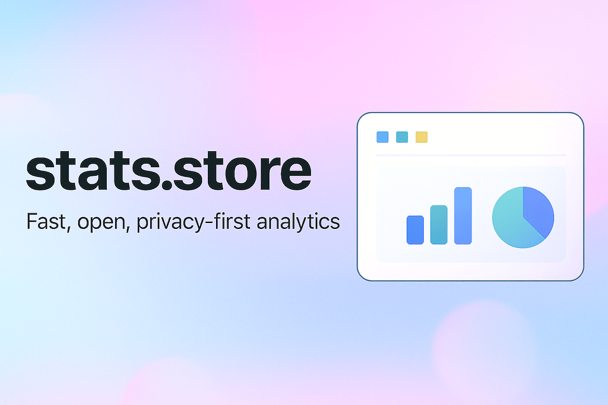

# stats.store 📊 — Sparkle checks in, useful numbers come out



[](https://github.com/steipete/stats-store/actions/workflows/ci.yml)
[](package.json)
[](https://github.com/steipete/stats-store)

stats.store proxies [Sparkle](https://sparkle-project.org/) appcast requests and presents the attached update statistics in a dashboard for macOS app maintainers. The hosted service is free for open-source apps, and the project can also be self-hosted with Supabase and Vercel.

```xml
<key>SUFeedURL</key>
<string>https://stats.store/api/v1/appcast/appcast.xml</string>
```

The proxy returns the app's registered upstream feed and records the profile fields Sparkle sends with the update check.

## Install

The hosted service at [stats.store](https://stats.store) does not require an installation. [Email Peter](mailto:peter@steipete.me) with the app's display name, bundle identifier, and current appcast URL to register an open-source app.

For your own deployment, use Node.js 24 or newer and pnpm 11.9 or newer, then follow the [deployment guide](docs/deployment.md) to configure Supabase, apply the database migrations, and deploy the Next.js app.

## Quick start

After the app is registered, replace its existing `SUFeedURL` value with the stats.store proxy URL:

```xml
<key>SUFeedURL</key>
<string>https://stats.store/api/v1/appcast/appcast.xml</string>
```

Sparkle continues to check for updates through the same appcast. Once update checks arrive, open [stats.store](https://stats.store) to inspect daily users, app-version adoption, macOS versions, CPU architectures, hardware models, languages, memory, and core counts.

Prerelease channels can use `https://stats.store/api/v1/appcast/appcast-prerelease.xml`. The registered upstream feed must expose the corresponding appcast; see the [appcast proxy guide](docs/APPCAST_PROXY.md) for URL mapping and troubleshooting.

## How it works

1. Sparkle requests the proxy URL and identifies the app by bundle identifier, app name, or its user-agent.
2. stats.store hashes the request IP with the current UTC date and records the Sparkle fields that are present.
3. The proxy fetches the app's registered upstream appcast and returns it to Sparkle.
4. The dashboard reads aggregate data from Supabase and updates through Supabase Realtime.

For apps that send telemetry directly, the project also exposes `POST /api/v1/ingest`; its payload and responses are documented in the [Sparkle integration guide](docs/SPARKLE_INTEGRATION.md).

## Data and privacy

The service stores a daily SHA-256 digest derived from the request IP, never the raw IP. Including the date makes the digest useful for counting daily unique clients without creating a stable identifier across days.

When Sparkle supplies them, stats.store records the app and Sparkle versions, macOS version, CPU type and core count, language, hardware model, and memory. It does not receive in-app behavior events through the appcast proxy. Vercel Web Analytics is disabled unless a self-hosted deployment explicitly sets `NEXT_PUBLIC_ENABLE_VERCEL_ANALYTICS=1`.

The [architecture notes](docs/architecture.md) describe the data flow, schema, endpoints, and aggregation model. The [project story](https://steipete.me/posts/2025/stats-store-privacy-first-sparkle-analytics) explains the motivation behind the hosted service.

## Self-hosting

Self-hosting requires a Supabase project and the environment values listed in [`.env.example`](.env.example). Apply every numbered SQL file currently present in `scripts/` in numeric order, then apply the managed migrations in `supabase/migrations/` as described in the [deployment guide](docs/deployment.md).

With the database and `.env.local` ready:

```sh
pnpm install
pnpm dev
```

The local dashboard runs at `http://localhost:3000`. See the [registration guide](docs/app-registration.md) to add an app and the [real-time setup guide](docs/realtime-setup.md) to enable live dashboard updates.

## Development

```sh
pnpm lint
pnpm typecheck
pnpm test
SKIP_ENV_VALIDATION=true pnpm build
```

Tests cover the API routes, dashboard components, hooks, and data formatting. See [tests/README.md](tests/README.md) for focused commands and [CONTRIBUTING.md](CONTRIBUTING.md) for the contribution workflow.

## Community

Use [GitHub Issues](https://github.com/steipete/stats-store/issues) for bugs and feature discussions. You can also reach [Peter Steinberger](mailto:peter@steipete.me) or follow [@steipete](https://twitter.com/steipete).

Built by [Peter Steinberger](https://github.com/steipete) for the Mac developer community.

## License

No license file is currently included in this repository.
